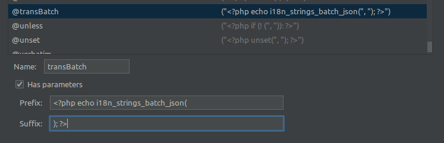

# i18n strings batch

[](https://github.com/yaroslawww/laravel-i18n-strings-batch/blob/master/LICENSE.md)
[](https://packagist.org/packages/yaroslawww/laravel-i18n-strings-batch)
[](https://scrutinizer-ci.com/g/yaroslawww/laravel-i18n-strings-batch/build-status/master)
[](https://scrutinizer-ci.com/g/yaroslawww/laravel-i18n-strings-batch/?branch=master)
[](https://scrutinizer-ci.com/g/yaroslawww/laravel-i18n-strings-batch/?branch=master)

## Installation

Install the package via composer:

```bash
composer require yaroslawww/laravel-i18n-strings-batch
```

## Usage

#### Set specific directory for language strings.

As usually js strings has other formatting for `choise` and others - you will want set all js strings to specific
directory and call batches without specify directory each time:

```injectablephp
use I18nStringsBatch\I18nStringsBatchManager;

class AppServiceProvider extends ServiceProvider
{
    public function register()
    {
        I18nStringsBatchManager::setDefaultDirectoryPrefix('front-js');
    }
}
```

#### Usage in php

```injectablephp
\I18nStringsBatch\Facades\I18nStringsBatch::getBatch(["licenses-list", "modal-confirmation"]);
\I18nStringsBatch\Facades\I18nStringsBatch::getBatchJson(["licenses-list", "modal-confirmation"]);
// or
\I18nStringsBatch\Facades\I18nStringsBatch::getBatch("modal-confirmation");
\I18nStringsBatch\Facades\I18nStringsBatch::getBatchJson("modal-confirmation");

// Using helpers
i18n_strings_batch(["licenses-list", "modal-confirmation"])
i18n_strings_batch_json(["licenses-list", "modal-confirmation"])
// or
i18n_strings_batch("modal-confirmation")
i18n_strings_batch_json("modal-confirmation")
```

#### Usage with component

```html
<licenses-list
    :i18n-batch='@transBatch("licenses-list")'
/>
<!-- or -->
<licenses-list
    :i18n-batch='@transBatch(["licenses-list", "modal-confirmation"])'
/>
```

### Usage with vue

Example you can find [there](./docs/vue.md)

### Add directive to PHPStorm



```txt
transBatch
<?php echo i18n_strings_batch_json(
); ?>
```

## Credits

- [](https://think.studio/)
